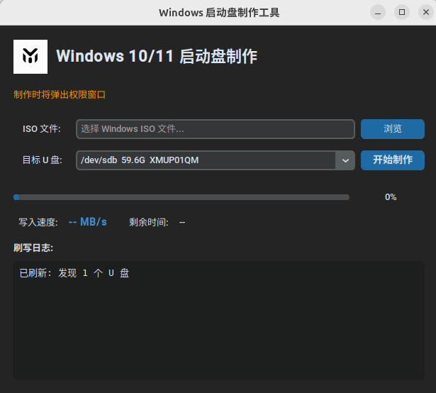

# startupdisk - Linux 下 Windows 启动盘制作工具

在 Linux 系统上制作 Windows 10/11 UEFI 启动盘。支持 `install.wim` 大于 4GB 的镜像，通过 [UEFI:NTFS](https://github.com/pbatard/uefi-ntfs) 实现从 NTFS 分区 UEFI 启动。



## 特性

- 图形界面（GUI）与命令行（CLI）均可使用
- 自动检测并列出可用 U 盘
- 自动下载 UEFI:NTFS 引导镜像（或手动指定）
- 实时显示写入进度、速度（MB/s）和剩余时间
- 非 root 用户自动通过 `pkexec` 弹出授权窗口，无需手动 `sudo`
- 支持强制停止刷写

## 快速开始

克隆仓库后，直接运行启动脚本：

```bash
./start.sh
```

首次运行会自动安装所需依赖（需已安装 `pipenv`、`parted`、`ntfs-3g`、`python3-tk`），后续直接启动 GUI。

- 启动后自动检测可用 U 盘
- 选择 ISO 文件和目标 U 盘，点击「开始制作」
- 非 root 用户会弹出系统授权窗口，授权后自动继续
- 制作过程中可通过「强制停止」终止刷写

### 命令行

```bash
# 列出可用 U 盘
python -m startupdisk list

# 制作启动盘（需 root）
sudo python -m startupdisk create -i /path/to/Win11.iso -d /dev/sdb -y
```

## 工作原理

1. **分区**：在 U 盘创建 GPT 分区表；主分区 NTFS 存放 Windows 文件，末尾小分区写入 UEFI:NTFS 引导镜像
2. **引导**：UEFI:NTFS 让固件能从 NTFS 分区引导，解决 UEFI 通常只支持 FAT32 的限制
3. **复制**：挂载 ISO，将全部文件复制到 U 盘 NTFS 分区；大文件分块写入并通过 `fdatasync` 确保数据真正落盘，进度反映真实写入速度
4. **进度**：写入速度使用双 EMA 算法平滑，每 500ms 等间隔更新显示

## 注意事项

- ⚠️ **操作不可逆**：制作前会格式化 U 盘，请确认选中的是正确设备
- 建议 U 盘容量 ≥ 8GB（Windows 11 推荐 ≥ 16GB）
- 若无法访问 GitHub，可手动下载 `uefi-ntfs_x64.img` 到 `~/.cache/startupdisk/`，或通过 `--uefi-ntfs` 指定本地路径

## 许可证

MIT
